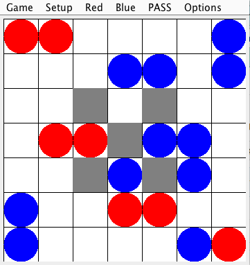
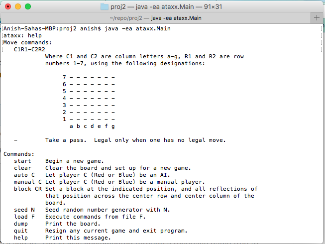
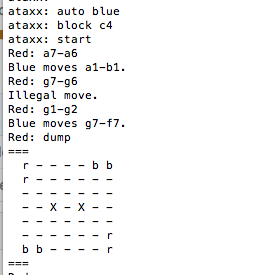

# Ataxxx
CS61B board game project with a functional GUI and AI. 
The AI was implemented through a recursive game tree to make 
the game very challenging. The GUI was implemented using 
the standard Java library 'Graphics'.

